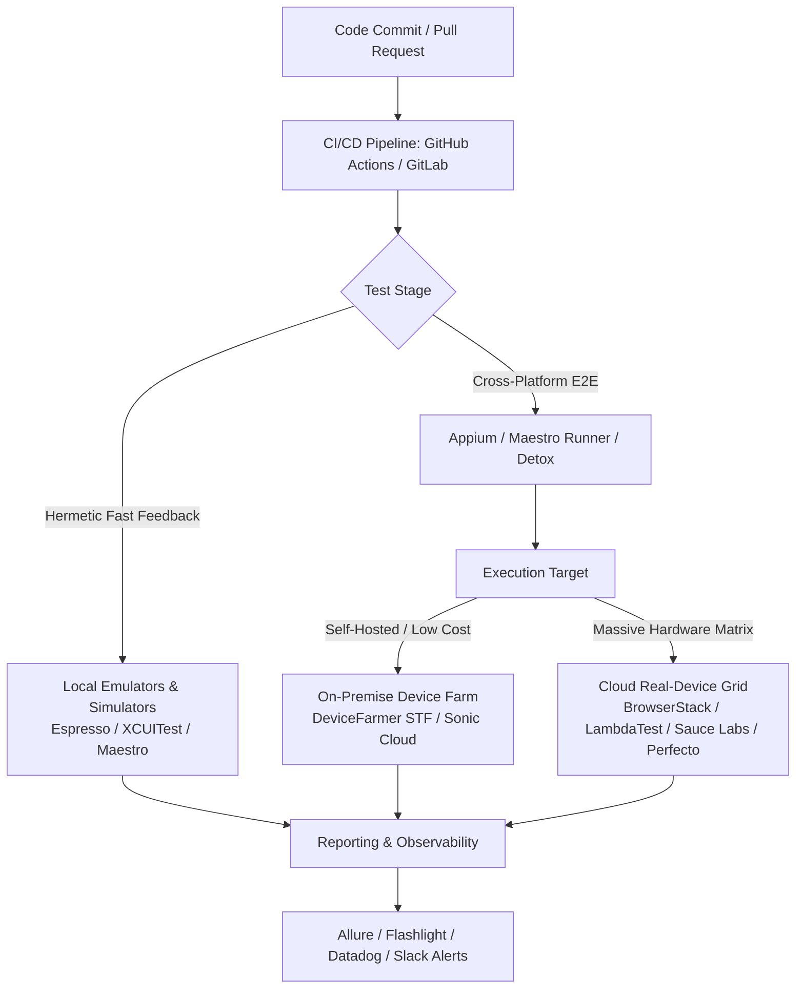

  

# 📱 Awesome Mobile App Testing Platform

  
  
  
  
  
  
  

---

## 🌟 Overview & Ecosystem Guide

A curated directory of top **Mobile App Testing Platforms**, **Real-Device Clouds**, and **Open-Source Test Automation Frameworks** for Android and iOS engineering teams.

Whether you are scaling **automated End-to-End (E2E) testing**, setting up a **self-hosted device farm**, executing **cross-device manual exploration**, auditing **mobile performance**, or benchmarking **AI-assisted test agents**, this guide tracks industry-standard tools, pricing models, and architectural best practices.

*Last updated: August 2026*

---

## 📑 Table of Contents
- [☁️ SaaS / Hosted Real-Device Platforms](#️-saas--hosted-real-device-platforms)
  - [📊 Market Overview & Industry Dynamics](#-market-overview--industry-dynamics)
  - [🏢 Enterprise & Commercial Testing Clouds](#-enterprise--commercial-testing-clouds)
- [🛠️ Open-Source Frameworks & Device Lab Tools](#️-open-source-frameworks--device-lab-tools)
- [🏗️ Recommended Architecture Stacks](#️-recommended-architecture-stacks)
- [🤝 How to Contribute](#-how-to-contribute)
- [📈 Star History](#-star-history)
- [⚖️ Disclaimer](#️-disclaimer)

---

## ☁️ SaaS / Hosted Real-Device Platforms

### 📊 Market Overview & Industry Dynamics
> **Estimated Market Size & Sector Structure**: The global mobile application testing market is valued at approximately **$7.70 Billion in 2025** and projected to reach **$9.02 Billion in 2026** (growing at a compound annual growth rate of **15%–18% CAGR** towards $18B+ by 2030). The sector is **moderately to highly fragmented** rather than winner-take-all—spanning public/private real-device clouds, AI-driven autonomous testing engines, and global crowdtesting networks—because teams must combat extreme device and OS fragmentation across **24,000+ distinct Android and iOS hardware profiles**.

### 🏢 Enterprise & Commercial Testing Clouds
*Below is a breakdown of the leading commercial SaaS mobile testing platforms, sorted descending by company scale (valuation / annual revenue).*

| Platform | Company Size (Valuation / Revenue) | Description | Pricing (Starting Tier) | Free Tier / Free Trial Limits |
| :--- | :--- | :--- | :--- | :--- |
| **[Perfecto (OpenText)](https://www.perfecto.io/)** | **~$5.17B Revenue** (Parent OpenText, NASDAQ: OTEX; ~$9B+ Market Cap) | Enterprise mobile and web testing cloud with private/dedicated devices, rich analytics, biometric simulation, and strict compliance support. | Starts at **~$83/month** (Live Testing starter tier; ~$300/month for automated execution) | **14-day free trial** (instant cloud device access with test analytics and reporting) |
| **[BrowserStack App Live & Automate](https://www.browserstack.com/)** | **~$4.08B Valuation** (~$230M+ ARR) | Market-leading real-device cloud with an extensive global inventory of iOS and Android hardware for live interactive and automated Appium/Espresso runs. | Starts at **$29/user/month** (App Live billed annually; App Automate from $199/parallel/month) | **Free trial**: 30 minutes of manual app testing (App Live) + 100 minutes of automated mobile testing (App Automate) |
| **[BitBar (SmartBear)](https://www.bitbar.com/)** | **~$1.8B–$2.0B Valuation** (Parent SmartBear; ~$150M+ ARR) | Flexible real-device testing cloud natively supporting Appium, Espresso, XCUITest, and custom test runners across public and private device pools. | Starts at **$39/parallel/month** (Live Testing billed annually; Automated Testing from $177/parallel/month) | **14-day free trial** (no credit card required; access to real Android and iOS devices) |
| **[Applause](https://www.applause.com/)** | **>$200M ARR** (~$500M+ Enterprise Value) | World-leading managed and crowdsourced testing network delivering real-world device coverage, localization, payments QA, and human feedback. | Custom enterprise engagement (pilots scoped per release cycle or testing program) | **Guided platform demo & structured pilot upon request** (no self-serve free plan; pilot programs available) |
| **[LambdaTest / TestMu AI](https://www.lambdatest.com/)** | **~$400M Valuation** (High-growth testing cloud) | AI-infused mobile and cross-browser cloud providing real-device access, smart test execution, and comprehensive emulator/simulator support. | Starts at **$15/user/month** (Live Testing; Real Device Cloud from $25/month; App Automation from $249/parallel/month) | **Free-for-life tier**: 60 minutes/month live testing (10 mins/session, 1 parallel test); 15-day trial for enterprise features |
| **[Sauce Labs Mobile](https://saucelabs.com/)** | **~$300M–$500M Valuation** (~$100M+ ARR) | Unified enterprise digital quality platform providing real-device cloud, error monitoring, API testing, and machine-learning test failure analysis. | Starts at **$39/month** (Live Mobile Testing; Real Device Cloud from $199/month) | **14-day free trial** (includes 100 automated and live testing minutes on the Real Device Cloud) |
| **[HeadSpin](https://www.headspin.io/)** | **~$250M Valuation** (~$15M ARR) | Performance and UX-focused mobile testing platform monitoring real devices over global carrier networks with AI audio/video and network insights. | Starts at **~$83/month** (CloudTest Go tier for digital engineering teams) | **Free trial available upon request / sign-up** (time-limited cloud device evaluation environment) |
| **[Testlio](https://testlio.com/)** | **~$50M–$100M Valuation** (~$20M ARR) | Managed quality engineering and crowdsourced testing platform combining expert manual testers with automation runtimes (LeoCore™). | LeoCore platform subscription fee + annual consumption testing fund | **Guided platform consultation & pilot program on request** (no self-serve free plan; case-by-case pilots) |
| **[Kobiton](https://kobiton.com/)** | **~$54M Valuation** (~$10M–$15M ARR) | Mobile QA platform specializing in real-device management, scriptless automation, BYOD (Bring Your Own Device), and on-premises lab setups. | Starts at **$83/month** (billed annually; includes monthly device minute allotment) | **15-day free trial** (no credit card required; access to real devices and manual/automated testing) |
| **[TestGrid](https://www.testgrid.io/)** | **~$20M–$35M Valuation** (~$5.3M ARR, Pre-Series A) | Lightweight end-to-end testing platform offering real device clouds, AI test generation (CoTester), no-code automation, and IoT/POS testing. | Starts at **$199/seat/month** (CoTester Starter Package) | **Guided POC / free trial upon demo request** (solutions-engineer guided evaluation against custom test scenarios) |

---

## 🛠️ Open-Source Frameworks & Device Lab Tools

*Below are the most popular open-source repositories and frameworks for mobile app automation, performance profiling, and self-hosted device clouds, sorted descending by GitHub Star Count.*

| Framework / Tool | Github_Stars | Description | Supported Platforms |
| :--- | :---: | :--- | :--- |
| **[Appium](https://github.com/appium/appium)** |  | The de facto open-source standard for cross-platform mobile automation over the W3C WebDriver protocol. Supports native, hybrid, and web apps. | Android, iOS, Windows, macOS, Flutter |
| **[MobSF (Mobile Security Framework)](https://github.com/MobSF/Mobile-Security-Framework-MobSF)** |  | Automated, all-in-one mobile app pen-testing, malware analysis, static (SAST) and dynamic (DAST) security assessment framework. | Android, iOS, Windows |
| **[Maestro](https://github.com/mobile-dev-inc/maestro)** |  | Fast, modern, declarative E2E testing framework using concise YAML flows. Built-in tolerance for flakiness and seamless CI integration. | Android, iOS, React Native, Flutter, Web |
| **[OpenSTF (Smartphone Test Farm)](https://github.com/openstf/stf)** |  | Pioneer self-hosted platform for controlling and debugging real Android devices remotely via browser. | Android (Self-Hosted Lab) |
| **[Flipper](https://github.com/facebook/flipper)** |  | Meta's extensible mobile developer platform and desktop UI for inspecting network traffic, layout trees, databases, and logs. | Android, iOS, React Native |
| **[Detox](https://github.com/wix/Detox)** |  | Gray-box end-to-end mobile testing library that synchronizes directly with the app runtime loop to eradicate test flakiness. | Android, iOS, React Native |
| **[WebdriverIO](https://github.com/webdriverio/webdriverio)** |  | Next-generation Node.js test framework with first-class native Appium automation plugins, multi-device orchestration, and rich reporting. | Android, iOS, Mobile Web |
| **[Airtest Project](https://github.com/AirtestProject/Airtest)** |  | Cross-platform UI automation framework utilizing computer vision (OpenCV) image recognition, built especially for games and complex graphic apps. | Android, iOS, Windows, Unity |
| **[DeviceFarmer STF](https://github.com/DeviceFarmer/stf)** |  | Actively maintained community fork of Smartphone Test Farm (STF) supporting modern Android releases, remote access, and device clustering. | Android, iOS (Device Farm) |
| **[Agent Device](https://github.com/callstack/agent-device)** |  | Mobile app automation and verification system built specifically for AI coding agents. Includes CLI, MCP server, and typed Node APIs. | Android, iOS, HarmonyOS, Android TV |
| **[Agent QA](https://github.com/vostride/agent-qa)** |  | Self-improving QA agent for authoring and running natural-language regression tests through a CLI and MCP server, with retained test memory and reviewable run evidence. Source-available under FSL-1.1-ALv2 and converts to Apache-2.0 after two years. | Web, Android, iOS (through configured browser/device providers) |
| **[Sonic Cloud](https://github.com/SonicCloudOrg/sonic-server)** |  | Distributed, open-source mobile testing platform facilitating remote real-device clustering, automated script execution, and visual validation. | Android, iOS (Distributed Cloud) |
| **[Appium Inspector](https://github.com/appium/appium-inspector)** |  | Official visual GUI tool for inspecting mobile DOM/view hierarchies, generating XPath/Accessibility ID selectors, and recording user actions. | Android, iOS, Mac, Windows |
| **[Appium Python Client](https://github.com/appium/python-client)** |  | Official Python language client bindings for Appium, supporting PyTest, Selenium Grid, and mobile gestures. | Android, iOS |
| **[Flashlight](https://github.com/bamlab/flashlight)** |  | "Lighthouse for Mobile"—automated CLI & CI mobile performance suite measuring FPS, CPU usage, RAM footprint, and battery drain. | Android, iOS (Native, RN, Flutter) |
| **[Appium Java Client](https://github.com/appium/java-client)** |  | Official Java client library for Appium with deep support for TestNG, JUnit5, Page Object Model (POM), and mobile touch actions. | Android, iOS |

### 📱 Official Native Platform SDK Frameworks
- **[Android Espresso](https://developer.android.com/training/testing/espresso)**: Google’s official UI testing framework for Android native apps, tightly integrated with `AndroidX Test` and Android Studio for lightning-fast hermetic execution.
- **[Apple XCUITest](https://developer.apple.com/documentation/xctest)**: Apple’s official UI and unit testing framework for iOS, iPadOS, watchOS, and tvOS native automation inside Xcode.

---

## 🏗️ Recommended Architecture Stacks

### 💡 Strategy Cheat Sheet
- **For React Native Teams**: Use **Detox** for synchronized gray-box CI runs and **Maestro** for high-level user journey flows.
- **For Native Android & iOS Teams**: Use **Espresso** (Android) and **XCUITest** (iOS) for rapid PR verification, paired with **Appium** or **Maestro** for full end-to-end integration flows.
- **For Self-Hosted Private Device Farms**: Combine **DeviceFarmer STF** or **Sonic Cloud** with physical hardware racks to eliminate recurring per-minute device licensing costs.
- **For Broad Hardware Coverage (Global Releases)**: Utilize **BrowserStack**, **Sauce Labs**, or **LambdaTest** to validate edge compatibility across global carrier networks and OEM skins (Samsung OneUI, Xiaomi MIUI, etc.).

---

## 🤝 How to Contribute
1. 🍴 Fork this repository.
2. 📝 Add or update an entry in `README.md` (keep entries objective, accurate, and properly categorized).
3. 🔍 Ensure links, pricing tiers, and GitHub star badges follow the existing table structure.
4. 🚀 Submit a Pull Request with a brief explanation of your additions.

⭐ **Star this repository** if you find it helpful for your QA & mobile engineering workflow!

---

## 📈 Star History

---

## ⚖️ Disclaimer
- This is a **community-curated** list for educational and engineering reference—not an endorsement.
- Mobile testing often involves real hardware, firmware variants, and sensitive build artifacts. Ensure your device farms maintain strict secret hygiene and comply with platform terms of service.
- Pricing, company valuations, and free tier quotas are subject to vendor updates. Always check official provider websites for the most current service level terms.

---

  <b>Made with ❤️ for Mobile QA Engineers, Developers, and Platform Teams building world-class Android &amp; iOS apps.</b>

